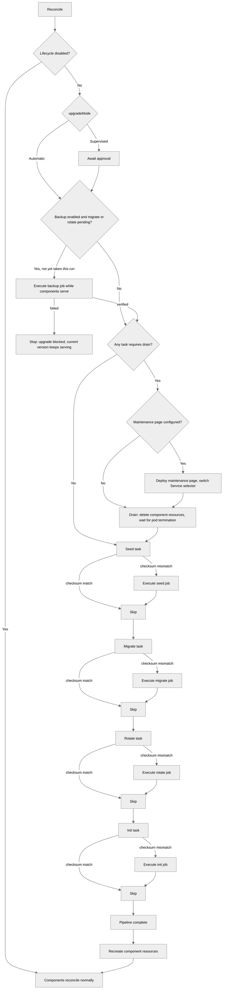

<!--
Licensed to the Apache Software Foundation (ASF) under one
or more contributor license agreements.  See the NOTICE file
distributed with this work for additional information
regarding copyright ownership.  The ASF licenses this file
to you under the Apache License, Version 2.0 (the
"License"); you may not use this file except in compliance
with the License.  You may obtain a copy of the License at

  http://www.apache.org/licenses/LICENSE-2.0

Unless required by applicable law or agreed to in writing,
software distributed under the License is distributed on an
"AS IS" BASIS, WITHOUT WARRANTIES OR CONDITIONS OF ANY
KIND, either express or implied.  See the License for the
specific language governing permissions and limitations
under the License.
-->

# Lifecycle

The operator manages database migrations and application initialization through dedicated lifecycle tasks. This page covers configuration, behavior, and troubleshooting.

## Overview

The `spec.lifecycle` section controls up to four sequential tasks:

1. **seed** — database snapshot from an external source (staging workflows)
2. **migrate** — `superset db upgrade` (database schema migration)
3. **rotate** — `superset re-encrypt-secrets` (secret key rotation)
4. **init** — `superset init` (application initialization: roles, permissions)

An optional **backup** task snapshots the metastore in front of migrate or rotate so an upgrade can be reverted; see [Pre-Upgrade Backup](#pre-upgrade-backup).

Tasks run as parent-owned Jobs. The parent Superset controller orchestrates sequencing, gating, re-runs, Job lifecycle, retries, and timeouts, and stores durable task state in `status.lifecycle`.

Lifecycle is enabled by default even when `spec.lifecycle` is nil; disable it explicitly with `spec.lifecycle.disabled: true`.

**Key behaviors:**

- Seed must complete before migrate starts; migrate before rotate; rotate before init
- Components are not created or updated until all enabled tasks complete
- When config or image changes require a re-run, the parent deletes the old task Job and creates a fresh one

## Task Triggers

Each task has hardcoded trigger inputs — what it watches for changes:

| Task | Watches | Re-runs when... |
|------|---------|-----------------|
| Seed | `trigger` field, `cronSchedule` tick, source config, excludes, target Superset image | Trigger value changes, schedule tick boundary crossed, source DB config changes, or the target image changes (so the data set is re-seeded before migrate runs against it) |
| Migrate | Image (resolved lifecycle image), `metastore.createDatabase` flag | Image tag or repository changes, or `createDatabase` is toggled |
| Rotate | `trigger` field, `secretKeyFrom` ref, `previousSecretKeyFrom` ref | Secret key references change or trigger value changes |
| Init | Config checksum (rendered Python config) | Any config-affecting field changes |
| Backup | Pending migrate/rotate, `trigger` field | A migrate or rotate run is about to start and no backup was taken since the last completed lifecycle run |

All tasks except backup also re-run when an upstream task re-executes (automatic propagation). Backup sits outside that chain: changing its spec never re-runs another task.

### Manual Trigger

Every task has a `trigger` field (on `BaseTaskSpec`) — an opaque string that forces a re-run when changed. Changing a trigger also cascades to all downstream tasks:

```yaml
spec:
  lifecycle:
    migrate:
      trigger: "force-2026-05-10"  # forces migrate + init to re-run
    init:
      trigger: "reset-roles"       # forces only init to re-run
```

### Disabling Tasks

Set `disabled: true` to skip a task entirely:

```yaml
spec:
  lifecycle:
    migrate:
      disabled: true  # user manages migrations externally
```

### Scheduled Execution

Tasks that support scheduling (currently seed) accept a `cronSchedule` field — a standard cron expression (5 to 7 fields; the sixth/seventh fields add optional seconds and year precision) that triggers periodic re-execution:

```yaml
spec:
  environment: Staging
  lifecycle:
    seed:
      cronSchedule: "0 2 * * *"  # daily at 2 AM UTC
      source:
        host: postgres-prod.db.svc
        database: superset_prod
        username: prod_reader
        passwordFrom:
          name: prod-reader-creds
          key: password
```

When a schedule is configured, the operator automatically re-runs the full lifecycle pipeline (seed → migrate → rotate → init) each time a cron tick boundary is crossed. The `trigger` field remains functional for manual overrides on top of the schedule — both contribute independently.

**How it works:**

- The operator computes the "current tick" (most recent past time matching the expression) and includes it in the task checksum
- When the clock crosses a cron boundary, the tick changes, the checksum changes, and the pipeline re-runs
- The operator requeues itself to wake at the next cron tick
- If the operator is down during a scheduled tick, it catches up on the next reconcile
- If the pipeline is still running when a tick fires, it completes normally; the new tick is detected afterward and triggers one re-run (no backlog accumulation)

**Status reporting:**

The seed task status includes `lastScheduledAt` (the tick that triggered the most recent run) and `nextScheduleAt` (the next future tick).

**Alternative — external CronJob:**

For teams that prefer external scheduling, a Kubernetes CronJob can patch the `trigger` field on a cron schedule. This requires a CronJob resource, ServiceAccount, RoleBinding, and a kubectl image, but keeps the scheduling logic outside the operator.

When disabled, the task's Job and ConfigMap are deleted, its projected status is cleared from the parent, and it does not participate in the pipeline. Downstream tasks still run but don't receive propagation from the disabled task.

## Upgrade Mode

The `upgradeMode` field controls how image upgrades are handled:

- **Automatic** (default) — tasks run immediately when an image change is detected
- **Supervised** — tasks wait for an annotation-based approval before running

```yaml
spec:
  lifecycle:
    upgradeMode: Supervised
```

When an image change is detected in supervised mode, the operator sets `status.phase: AwaitingApproval` and records the upgrade context in `status.lifecycle.upgrade`. Approve the upgrade by annotating the CR with the recorded approval token:

```bash
TOKEN=$(kubectl get superset my-superset \
  -o jsonpath='{.status.lifecycle.upgrade.approvalToken}')
kubectl annotate superset my-superset \
  superset.apache.org/approve-upgrade="${TOKEN}" --overwrite
```

The approval is consumed once: the operator clears the annotation automatically after lifecycle tasks complete or the image change is otherwise settled. This prevents a stale approval annotation from approving a later image change. If the target image changes while an upgrade is awaiting approval, the approval token changes and the new transition must be approved separately. You can monitor the upgrade status with:

```bash
kubectl get superset my-superset -o jsonpath='{.status.lifecycle}'
```

### Changing the image tag

Any change to the resolved lifecycle image tag re-runs the migrate task (`superset db upgrade`), whether the new tag is a higher or lower version. The operator does not compare versions — it runs `superset db upgrade` on every image change.

The migrate trigger keys off the resolved `repository:tag` string, not the underlying image digest. Mutable tags therefore do **not** re-run migrate: repointing a tag such as `latest` (or any tag) at a new digest leaves the string unchanged, so no migration runs. To force a migration, change the tag to a distinct value or bump `migrate.trigger`.

Migrate only ever runs `superset db upgrade`; the operator never runs `superset db downgrade` (Superset's down migrations are poorly tested and often break). So pinning back to an older image re-runs the forward migration rather than reversing the schema — you are responsible for ensuring the database is compatible with the target image, for example by restoring a backup taken before the upgrade. Enable [`lifecycle.backup`](#pre-upgrade-backup) (or take your own backup before every upgrade) so you can revert if needed.

## Drain Behavior

Each task declares whether it requires components to be drained (scaled to zero) before execution. The operator drains once before the first pending task that requires it when at least one configured component has desired replicas greater than zero, and recreates components after the pipeline completes. A config-only change that only re-runs the default init task does not drain components.

| Task | Default `requiresDrain` | Rationale |
|------|------------------------|-----------|
| Seed | `true` | DROP DATABASE fails with active connections |
| Backup | `false` | Runs before drain: the dump is a consistent snapshot taken while the current version keeps serving, so a slow or failed backup causes no downtime |
| Migrate | `true` | Schema changes risk deadlocks and version/schema inconsistencies |
| Rotate | `true` | After re-encryption, stored secrets use the new key — components with the old key would fail to decrypt |
| Init | `false` | Role/permission operations are safe with components running |

Override per-task when needed:

```yaml
spec:
  lifecycle:
    migrate:
      requiresDrain: false  # opt-in to rolling migrations (additive changes only)
    init:
      requiresDrain: true   # force drain before init (rare)
```

During a drain, Ingress/HTTPRoute and NetworkPolicy resources are preserved because they are owned by the parent CR. Once all lifecycle tasks complete, components are recreated and traffic resumes automatically.

### Maintenance Page

By default, the web UI is unreachable while components are drained. To avoid user confusion during upgrades, enable the maintenance page:

```yaml
spec:
  lifecycle:
    maintenancePage: {}
```

When enabled, the operator spins up a lightweight maintenance page **before** draining components and redirects all traffic from the web-server Service to it. The maintenance page is only started when a drain will actually run and the web-server component already has an existing workload. Initial installs skip the maintenance page because there is no existing web traffic to preserve. The Service name and ClusterIP are preserved, so Ingress, HTTPRoute, and direct Service consumers continue working without interruption. After lifecycle tasks complete, traffic is returned to the web-server pods automatically.

Parent Superset events report operator-level lifecycle milestones such as maintenance routing, drain start/completion, task starts, retries, and failures. Kubernetes-native Deployment, ReplicaSet, Job, and Pod events remain the source for lower-level workload creation and scaling details.

All paths return a 302 redirect to `/`, which serves the maintenance HTML page with a 30-second auto-refresh.

#### Customizing the message

```yaml
spec:
  lifecycle:
    maintenancePage:
      title: "Upgrade in Progress"
      message: "Superset is being upgraded to v4.1. Expected downtime: 10 minutes."
```

For complete control over the HTML page, use `body`:

```yaml
spec:
  lifecycle:
    maintenancePage:
      body: |
        <!DOCTYPE html>
        <html>
        <head><title>Maintenance</title><meta http-equiv="refresh" content="30"></head>
        <body><h1>We'll be right back</h1><p>02:00–03:00 UTC</p></body>
        </html>
```

#### Custom image

For advanced use cases (custom branding, dynamic status pages, HA), provide your own image. It must serve HTTP on the web-server port (default 8088):

```yaml
spec:
  lifecycle:
    maintenancePage:
      message: "Back in 30 minutes"
      image:
        repository: my-org/maintenance-server
        tag: v2
      replicas: 2
      podTemplate:
        container:
          command: ["/serve", "--port=8088", "--redirect-all=/"]
          resources:
            requests:
              cpu: 50m
              memory: 64Mi
```

In custom mode, `title`, `message`, and `body` are passed as environment variables (`SUPERSET_OPERATOR__MAINTENANCE_TITLE`, `SUPERSET_OPERATOR__MAINTENANCE_MESSAGE`, `SUPERSET_OPERATOR__MAINTENANCE_BODY`) — your image can use them for dynamic content.

## Lifecycle Flow

The following diagram shows the lifecycle pipeline. Tasks execute sequentially; components are drained before the first task that requires it, and recreated after the pipeline completes.



Disabled tasks are removed from the pipeline entirely (not shown as "skip"). With `backup.requiresDrain: true`, the backup runs after drain instead, immediately before migrate or rotate.

## Custom Commands

```yaml
spec:
  lifecycle:
    migrate:
      command: ["/bin/sh", "-c", "superset db upgrade && custom-migrate"]
    init:
      command: ["/bin/sh", "-c", "superset init && custom-seed"]
```

Both `adminUser` and `loadExamples` (see below) are mutually exclusive with a custom `lifecycle.init.command` — when using these fields, the operator constructs the full init command automatically.

## Auto-Creating the Metastore Database

Setting `metastore.createDatabase: true` attaches an idempotent init container to the migrate Job that runs `CREATE DATABASE` against the server before `superset db upgrade`. This avoids a chicken-and-egg pre-install step on fresh PostgreSQL/MySQL servers. See [Auto-creating the database](configuration.md#auto-creating-the-database) for full details, including the privilege requirement on the metastore user. The flag is redundant alongside `lifecycle.seed` (which already drops and re-creates the target database) but harmless.

## Timeout, Retries, and Pod Retention

Each task has configurable timeout and retry behavior:

```yaml
spec:
  lifecycle:
    podRetention:
      policy: Retain                # Delete | Retain | RetainOnFailure (default)
    migrate:
      timeout: 10m               # max time per attempt (default: 5m; 1h for backup)
      maxRetries: 5              # attempts before permanent failure (default: 3)
    init:
      timeout: 5m
      maxRetries: 3
```

On failure, the operator retries with exponential backoff (`10s * 2^(attempt-1)`, capped at 5m). If a Job exceeds the timeout while Running or Pending, it counts as a failed attempt.

If a task pod cannot start at all — a `CreateContainerConfigError` (for example a `runAsNonRoot` policy the image can't satisfy), an image pull failure, or an unschedulable pod — the operator surfaces the reason on the `Superset` status and events rather than silently waiting. Once you change the task's pod configuration (`securityContext`, resources, image, etc.), the operator recreates the task Job from the corrected spec automatically. This also rescues a task that has already exhausted its retries: editing how the pod runs lets it run again, with no need to delete the Job by hand. A purely application-level failure (unchanged pod, e.g. a broken migration) stays terminal so it does not loop.

**Task retention policies:**

| Policy | On Success | On Failure |
|---|---|---|
| `Delete` | Job and Pods deleted | Job and Pods deleted |
| `Retain` | Job and Pods kept | Job and Pods kept |
| `RetainOnFailure` (default) | Job and Pods deleted | Job and Pods kept for debugging |

The default keeps only failed task Jobs and Pods so you can inspect logs without cluttering the namespace with completed-success Jobs. Override to `Retain` if you want the full history, or `Delete` to garbage-collect everything.

To inspect logs of a retained failed Job:

```bash
kubectl logs job/<job-name> -c superset
```

## Admin User (Development Mode Only)

In Development mode, the operator can create an admin user during initialization:

```yaml
spec:
  environment: Development
  lifecycle:
    init:
      adminUser:
        username: admin           # default
        password: admin           # default
        firstName: Superset       # default
        lastName: Admin           # default
        email: admin@example.com  # default
```

All fields have defaults, so `adminUser: {}` creates a user with username/password `admin`/`admin`. The operator passes credentials as env vars and appends a `superset fab create-admin` step to the init command. This field is rejected in Production and Staging modes by CRD validation.

## Load Examples (Development Mode Only)

Load Superset's example dashboards and datasets during initialization:

```yaml
spec:
  environment: Development
  lifecycle:
    init:
      loadExamples: true
```

The operator appends a `superset load-examples` step to the init command. This field is rejected in Production and Staging modes by CRD validation. Note that Superset's built-in examples require an admin user with username `admin` — if you customize `adminUser.username`, example loading may fail.

## Lifecycle Pod Template

The `spec.lifecycle` section supports `podTemplate` with the same Pod and container fields as other components (tolerations, nodeSelector, volumes, etc. on `podTemplate`; env, resources, securityContext, etc. on `podTemplate.container`), so task Job Pods inherit top-level scheduling and security settings and can be customized independently:

```yaml
spec:
  lifecycle:
    podTemplate:
      container:
        resources:
          limits:
            memory: "2Gi"
    migrate:
      command: ["/bin/sh", "-c", "superset db upgrade"]
```

## Secret Key Rotation

The rotate task runs `superset re-encrypt-secrets` to re-encrypt stored secrets when the application secret key is rotated. It runs after migrate and before init.

To enable secret key rotation, set `previousSecretKey` (dev mode) or `previousSecretKeyFrom` (staging/production) on the parent spec, and add `lifecycle.rotate: {}`:

```yaml
apiVersion: superset.apache.org/v1alpha1
kind: Superset
metadata:
  name: my-superset
spec:
  secretKeyFrom:
    name: superset-secret-v2
    key: secret-key
  previousSecretKeyFrom:
    name: superset-secret-v1
    key: secret-key
  lifecycle:
    rotate: {}
```

The operator injects both `SECRET_KEY` and `PREVIOUS_SECRET_KEY` into all Python components. The rotate task Job uses both to decrypt stored secrets with the old key and re-encrypt with the new one. After rotation completes, components restart with the new key and can use `PREVIOUS_SECRET_KEY` for fallback decryption during the transition.

The command is idempotent: re-running it skips already-converted values. If no `PREVIOUS_SECRET_KEY` is set, it exits cleanly. If decryption fails for any entry, the entire transaction rolls back.

### Rotation Triggers

The task re-runs when:

- The `secretKeyFrom` or `previousSecretKeyFrom` references change (different Secret name or key)
- The `trigger` field changes (use this for in-place Secret content updates where the reference stays the same)

### Drain

By default, the rotate task requires drain (`requiresDrain: true`). After re-encryption commits, stored secrets are encrypted with the new key — components still running with the old key would fail to decrypt them. Override with `requiresDrain: false` only if you understand the implications.

### Cleanup

After confirming rotation succeeded, remove `previousSecretKeyFrom` and the `lifecycle.rotate` section. The previous secret key is no longer needed once all components have restarted with the new key.

## Pre-Upgrade Backup

The operator never runs `superset db downgrade`, so the way back from a failed or unwanted upgrade is restoring a snapshot taken before it. The backup task takes that snapshot automatically, verifies it, and blocks the upgrade if it cannot:

```yaml
spec:
  metastore:
    hostFrom: {name: db-conn, key: host}
    databaseFrom: {name: db-conn, key: dbname}
    usernameFrom: {name: db-conn, key: user}
    passwordFrom: {name: db-conn, key: password}
  lifecycle:
    upgradeMode: Supervised      # recommended: approve upgrades explicitly
    backup:
      destination:
        persistentVolumeClaim:
          claimName: superset-backups   # must already exist; the operator only references it
          subPath: my-superset          # optional
      retention:
        keepLast: 10                    # optional; by default completed backups are never deleted
```

### When It Runs

- At most once per lifecycle run, before the first pending migrate or rotate task. That covers image upgrades, `migrate.trigger`, and secret key rotation.
- Before drain, while the current version keeps serving. A slow backup adds no downtime, and a failed backup blocks the upgrade without taking the instance down. Set `backup.requiresDrain: true` to drain first instead, so the snapshot also contains the writes made in the minutes before the upgrade, at the cost of downtime for the duration of the dump.
- In `Supervised` mode, only after the upgrade is approved.
- Not for config-only changes that re-run only init, and not when only the backup spec itself changes.
- A retried migrate (for example after bumping `migrate.trigger`) reuses the snapshot taken before the first attempt, so a partially migrated database never replaces the clean restore point.
- Never while a migrate or rotate Job for the same run is already running (for example if backup is enabled mid-upgrade).
- On the first install the metastore database may not exist yet; a confirmed-absent database is skipped and reported as `Skipped` in status.
- `backup.trigger` forces a fresh snapshot in the next run that includes migrate or rotate; on its own it does not start a run.

### What It Writes

| Metastore | Dump | Integrity check before commit | Files |
|---|---|---|---|
| PostgreSQL | `pg_dump -Fc` (compressed custom format) | `pg_restore -f /dev/null` reads the whole archive back, decompressing and checking every data block | `{parent}_{UTC timestamp}_{previousTag}.dump` and `.json` |
| MySQL | `mysqldump --single-transaction --routines --triggers --no-tablespaces` (plain SQL) | the `-- Dump completed` trailer is present | `{parent}_{UTC timestamp}_{previousTag}.sql` and `.json` |

Each run follows the same sequence, and any failed step fails the backup:

1. Check that the destination is writable and that the database is reachable. For PostgreSQL, also check that the `pg_dump` client is not older than the server (`pg_dump` refuses to dump a newer server).
2. Dump to a `.partial` file. For PostgreSQL, `--lock-wait-timeout` makes the dump fail instead of queueing behind a long-held lock.
3. Run the integrity check above on the `.partial` file, then compute its SHA-256.
4. Rename it into place, then hash the committed file again and compare (post-commit check).
5. Write the JSON manifest next to the dump, atomically. It records the image tags, Alembic revision, database and client versions, size, SHA-256, and verification method, and it is the commit marker for retention and restore.

`previousTag` is the image tag the database was on before the run (`initial` on the first run); the timestamp comes first so that sorting by name is chronological. Files are created owner-only (mode `0600`, owned by the backup Job's UID), since the volume may be mounted by other pods. An interrupted, out-of-space, or corrupt run never leaves a file that looks complete, and an existing file is never overwritten. The operator removes its own stale `.partial` files.

### Checking Backups

The last five verified backups are listed in status, newest first:

```bash
kubectl get superset my-superset -o jsonpath='{range .status.lifecycle.backups[*]}{.createdAt}{"  "}{.location}{"  "}{.sha256}{"\n"}{end}'
```

Each entry carries `location` (`pvc://{claimName}/{subPath}/{file}`), `sizeBytes`, `sha256`, `alembicRevision`, `fromImage` (the image the database was on, which is the one to restore with), and `toImage`. `status.lifecycle.backup.message` summarizes the last run (`Backup written: ...`, `Skipped: ...`, or the failure reason), and the operator emits `BackupCompleted` and `BackupSkipped` Events. Status is a convenience view: the manifests on the volume are the source of truth, and entries are kept when backup is disabled or removed.

### Retention

By default the operator never deletes completed backups. With `retention.keepLast: N`, after a new backup is committed and verified, the operator deletes this Superset's older backups beyond the newest N. It matches backups by the resource UID recorded in their manifests, so backups of other Superset resources sharing the volume, and files without a manifest, are never touched. A recreated Superset gets a new UID and does not prune backups of its predecessor. A full volume makes the backup fail, which blocks the upgrade rather than proceeding without a snapshot; the failure message names the cause.

### Requirements and Defaults

- **Metastore**: the default command requires structured metastore fields (`host`/`hostFrom`, ...). For `uri`/`uriFrom`, set `backup.command`; the operator injects `SUPERSET_OPERATOR__DB_URI` (a SQLAlchemy URI, so strip the `+driver` suffix before passing it to `pg_dump`).
- **Client version**: the default images are `postgres:17-alpine` and `mysql:8.4`. For a newer PostgreSQL server, the backup fails with `pg_dump 17 cannot dump PostgreSQL 18; set spec.lifecycle.backup.image.tag to 18-alpine`; set `backup.image.tag` to match the server. Restore with a `pg_restore` at least as new as the one that wrote the dump.
- **Privileges**: the metastore user must be able to read every object in the database.
- **Security context**: the Job runs as the image's non-root user (UID 70 for PostgreSQL, 999 for MySQL) unless you pin a UID, and defaults the pod `fsGroup` to that UID (with `fsGroupChangePolicy: OnRootMismatch`) when you have not set one, so the volume is writable. Some volume types (for example NFS) ignore `fsGroup`.
- **OpenShift**: the default UID (70/999) and `fsGroup` are outside the UID range that the `restricted-v2` SCC assigns to a namespace, so the Job is rejected. Pin in-range values with `backup.podTemplate.podSecurityContext.runAsUser` and `fsGroup` (see the namespace's `openshift.io/sa.scc.uid-range` annotation). The same applies to the `createDatabase` init container.
- **Volume access mode**: a `ReadWriteOnce` claim can only be mounted on one node at a time. If another pod on a different node holds it (a retention CronJob, a restore pod, or another instance's backup sharing the claim), the backup pod stays `Pending` until its timeout, fails, and blocks the upgrade. Use a separate claim per instance, schedule housekeeping outside upgrade windows, or use a `ReadWriteMany` volume when the claim is shared.
- **Load**: the dump runs against the live database before drain. `pg_dump` and `mysqldump --single-transaction` do not block writers, but they add read load for the duration of the dump.
- **Timeout**: defaults to `1h` per attempt.
- **Pod template**: `backup.podTemplate` is merged over the top-level `spec.podTemplate`; like seed, `spec.lifecycle.podTemplate` does not apply.
- **Seed**: backup and seed are mutually exclusive (a seeded database is reproducible from its source, and a seed schedule would otherwise take a snapshot on every tick).

### Custom Destinations

To ship dumps elsewhere, override the command and image. The operator still provides the connection env vars (`SUPERSET_OPERATOR__DB_*` or `SUPERSET_OPERATOR__DB_URI`), `SUPERSET_OPERATOR__INSTANCE_NAME` and `SUPERSET_OPERATOR__BACKUP_FROM_TAG` for naming, `SUPERSET_OPERATOR__BACKUP_UID`, and `SUPERSET_OPERATOR__BACKUP_METADATA` (a JSON object with the resource name, namespace, UID, database type, and from/to images); `destination` is optional when `command` is set:

```yaml
spec:
  lifecycle:
    backup:
      image:
        repository: registry.example.com/pg-backup   # contains pg_dump and your upload tool
        tag: "17"
      command: ["/bin/sh", "-c", "set -eu; ..."]     # dump, verify, then upload; fail on any error
      podTemplate:
        container:
          envFrom:
            - secretRef: {name: backup-bucket-credentials}
```

A custom command owns the guarantees the default command provides (verification, never overwriting, retention). Make the script fail when any step fails; POSIX `sh` has no `pipefail`, so avoid piping `pg_dump` straight into an upload command. To show a failure reason in status, write it to `/dev/termination-log` before exiting non-zero. To record a backup in `status.lifecycle.backups`, write `{"file":"...","sizeBytes":N,"sha256":"...","alembicRevision":"...","createdAt":"RFC 3339"}` there on success; the operator validates every field and ignores anything else.

### When the Backup Fails

The upgrade stops before touching the database. Components are not drained and keep serving on the current version; with `requiresDrain: true` they stay drained, because bringing them up on the new image against the old schema is unsafe. `status.lifecycle.backup.message` shows the failing step and the tail of the tool's error output (credentials are redacted), for example `backup failed at connect: ... password authentication failed`. Then:

- Fix the cause. Any change to the backup pod configuration (image, resources, security context, command) retries it, even after retries are exhausted. If the fix was outside the Superset spec (for example freeing space on the volume), bump `backup.trigger` to retry.
- Or revert `spec.image.tag`: migrate no longer needs to run, so nothing changes and no backup is needed.
- Or set `backup.disabled: true` to proceed without a snapshot.

### Restoring

You need three things, so keep the last two outside the cluster as well:

- The dump and its manifest from the backup volume.
- The `SECRET_KEY` the database was encrypted with. Connection passwords in the metastore are encrypted with it, and it is not part of the dump. A dump taken before a key rotation needs the previous key.
- The image to restore with: `fromImage` in status or `superset.fromImage` in the manifest.

Then:

1. Pick the backup: `kubectl get superset my-superset -o jsonpath='{.status.lifecycle.backups[0]}'`, or the newest manifest on the volume.
2. Stop reconciliation: `kubectl patch superset my-superset --type merge -p '{"spec":{"suspend":true}}'`.
3. Stop Superset workloads: `kubectl delete deploy -l superset.apache.org/parent=my-superset` (the operator recreates them on resume).
4. From a pod that mounts the backup volume and runs as the backup Job's UID (70 for PostgreSQL, 999 for MySQL, or the UID you pinned, since dumps are owner-only), verify the dump before touching the database, then restore it:

    ```bash
    DUMP=/backup/my-superset_20260924T020000Z_6.0.1.dump
    echo "$(sed -n 's/.*"sha256":"\([0-9a-f]*\)".*/\1/p' "${DUMP%.dump}.json")  $DUMP" | sha256sum -c -
    pg_restore --clean --if-exists --no-owner -d "$DATABASE" "$DUMP"   # MySQL: mysql "$DATABASE" < file.sql
    ```

    To keep the current database for comparison, restore into a new database instead and point `spec.metastore` at it.
5. Set the image back to `fromImage` and resume with `suspend: false`. If migrate runs again, `superset db upgrade` for that version is a no-op on the restored schema. The resumed run takes a new backup of the restored database first.

### Limitations

- Backups on a PersistentVolumeClaim live in the same cluster (and usually the same zone) as the metastore. Copy them off-cluster, or use a custom command that uploads them, if they must survive losing the cluster.
- The pre-upgrade backup is an upgrade safety net, not a disaster-recovery strategy: there is no point-in-time recovery and no schedule. Use your database provider's snapshots or PITR alongside it.
- With the default `requiresDrain: false`, writes made between the snapshot and drain (usually seconds to minutes) are not in the dump.
- The integrity check proves the dump is complete and readable; it does not prove a restore succeeds against your server. Rehearse the restore procedure.
- Dumps are not encrypted by the operator. They contain everything in the metastore, including user data and connection secrets encrypted with `SECRET_KEY`; use an encrypted StorageClass and restrict access to the volume.
- PostgreSQL roles and tablespaces (global objects) and Valkey data are not backed up.
- MySQL has no client/server version preflight or lock wait timeout; a blocked dump is bounded by the task timeout.

## Seed (Development and Staging Mode Only)

The seed task creates a database snapshot from an external source into the CR's metastore before running migrations. This enables staging workflows where you test version upgrades against a copy of production data.

Seed is only allowed when `environment: Development` or `environment: Staging` — it performs a destructive DROP DATABASE on the target metastore and must never run against a production instance. Staging mode enforces secrets (like Production) while still permitting seed operations.

### Staging Workflow

The recommended pattern is a separate `Superset` CR for staging:

```yaml
apiVersion: superset.apache.org/v1alpha1
kind: Superset
metadata:
  name: superset-staging
spec:
  environment: Staging
  image:
    tag: "6.0.0"                     # version to test
  secretKeyFrom:
    name: staging-secret
    key: secret-key
  metastore:
    type: PostgreSQL
    host: postgres-staging.db.svc
    database: superset_staging
    username: superset_admin         # needs CREATEDB rights
    passwordFrom:
      name: staging-db-creds
      key: password
  lifecycle:
    seed:
      trigger: "2026-05-09-v1"       # change to re-seed
      source:
        hostFrom:
          name: prod-reader-connection
          key: host
        portFrom:
          name: prod-reader-connection
          key: port
        databaseFrom:
          name: prod-reader-connection
          key: dbname
        usernameFrom:
          name: prod-reader-connection
          key: user                  # read-only on production
        passwordFrom:
          name: prod-reader-creds
          key: password
      excludeTables:
        - tab_state
      excludeTableData:
        - logs
        - query
      timeout: 30m
    migrate: {}
    init: {}
  webServer: {}
  celeryWorker: {}
  # celeryBeat intentionally omitted — prevents alert double-triggers
```

The lifecycle pipeline runs: **seed → migrate → rotate → init → components**. Components are not deployed until all enabled tasks complete, and seed always drains existing components before running (DROP DATABASE fails with active connections). Only the tasks you configure run; `rotate`, for example, is skipped when no `lifecycle.rotate` spec is set.

### Seed Trigger and Scheduling

The seed task runs when its checksum changes. Two mechanisms trigger re-execution:

- **`trigger` field** — an opaque string (date, UUID, CI build ID). Changing it causes a re-seed. Use this for manual or CI-driven refreshes.
- **`cronSchedule` field** — a cron expression (5–7 fields, with optional seconds/year precision) for periodic re-execution. When the clock crosses a cron boundary, the task checksum changes automatically.

To disable seed without removing its configuration, set `disabled: true`.

### Table Exclusion

- `excludeTables` — tables excluded entirely (schema and data). Use for tables that are not needed and can be recreated by migrations (e.g., `tab_state`).
- `excludeTableData` — schema is dumped but data is not. Use for large tables where migrations expect the schema to exist but the data is not needed for testing (e.g., `logs`, `query`).

### Custom Seed Command

By default the operator constructs a streaming `pg_dump | psql` (or `mysqldump | mysql`) command. Override it for custom workflows (anonymization, database-native snapshots, etc.):

```yaml
spec:
  lifecycle:
    seed:
      command: ["/bin/sh", "-c", "custom-seed-script.sh"]
      image:
        repository: my-registry/custom-tools
        tag: "v1"
      source:
        host: postgres-prod.db.svc
        database: superset_prod
        username: prod_reader
        passwordFrom:
          name: prod-reader-creds
          key: password
```

When a custom command is set, the operator still injects all env vars (`SUPERSET_OPERATOR__SEED_SRC_*` and `SUPERSET_OPERATOR__DB_*`) so your script can use them.

Each source connection field supports either a literal or its mutually exclusive `From` counterpart (`hostFrom`, `portFrom`, `databaseFrom`, `usernameFrom`, and `passwordFrom`). This allows the seed Job to consume connection details published by a database operator without copying them into the `Superset` resource. `portFrom` must reference a decimal port string.

Changing a selector's Secret name or key changes the seed task checksum. Updating data behind an unchanged selector cannot be detected because the operator does not read Secrets; change `spec.lifecycle.seed.trigger` to run seed again with the new values. Use the corresponding downstream task trigger when only that task must rerun.

### Seed Image

The seed pod uses a database-tool image (not the Superset image):

| Source type | Default image |
|---|---|
| `postgresql` | `postgres:17-alpine` |
| `mysql` | `mysql:8.4` |

Override with `seed.image` if you need additional tools.

### Requirements

- **Metastore must use structured mode** (host, database, username) — passthrough URI mode is not supported for seed.
- **Metastore user must have CREATEDB rights** — the seed drops and recreates the target database.
- **Source user should be read-only** — the seed only reads from production.
- **Network access** — the seed pod needs egress to both source and target databases. Configure NetworkPolicy accordingly.

## How It Works Under the Hood

### Pipeline Checksum Model

The lifecycle uses a **checksum chain** to determine which tasks execute and which skip. Each task receives an incoming checksum from the previous stage, adds its own unique inputs, and produces a task checksum. On completion, that checksum is stored in the parent `status.lifecycle` field and becomes the incoming checksum for the next task.

```text
                     parentUID (stable anchor)
                         ↓
seed.checksum   = hash(parentUID, "Seed", command, trigger, scheduleTick, source, excludes, postSeedSQL, seedImage, targetImage)
                         ↓ (stored in parent status on completion)
migrate.checksum = hash(seed.status.checksum, "Migrate", command, trigger, image)
                         ↓ (stored in parent status on completion)
rotate.checksum  = hash(migrate.status.checksum, "Rotate", command, trigger, image, secretKey, secretKeyFrom, previousSecretKey, previousSecretKeyFrom)
                         ↓ (stored in parent status on completion)
init.checksum    = hash(rotate.status.checksum, "Init", command, trigger, image, configChecksum)
```

**The universal rule:** a task executes when its computed checksum differs from the completed checksum stored in parent status. If they match, the task skips.

**Upstream propagation is automatic:** when seed re-runs (e.g., trigger changed), its status checksum changes. That new value flows into migrate's checksum computation, making it differ from its stored value — so migrate re-runs too. The chain continues transitively through rotate to init.

**Isolation by design:** each task watches only its own relevant inputs. Migrate is image/schema-version driven and intentionally ignores feature/config changes — a config tweak does not re-run migrations. Init is the config-sensitive task: rendered `superset_config.py` changes propagate here. Seed tracks both the source connection identity and the *target* Superset image, so a staging image change triggers a fresh seed before migrations re-run. Rotate fires on secret-key transitions.

**Backup is outside the chain:** the backup task's checksum is `hash(parentUID, "Backup", settledChecksum, trigger)`, where `status.lifecycle.settledChecksum` is recorded only when a lifecycle run fully completes. It never feeds another task's checksum, so editing the backup spec cannot re-run migrate or init, and enabling backup leaves the checksums of every existing installation unchanged. It stays fixed for the whole run, so a retried migrate reuses the snapshot taken before the first attempt.

**What checksums do NOT cover:** checksums hash *task-semantic* inputs only. Pod-level fields like resource requests/limits, node selectors, tolerations, affinity, and other `podTemplate` knobs are not part of the task checksum and do not by themselves trigger a re-run. Such changes apply on the next execution that *is* triggered by a semantic input change. This is intentional: a pure scheduling tweak should not, for example, re-run a destructive `seed`.

### Why Jobs

- **Idempotent creation** — Each task uses a deterministic Job name, so repeated reconciles cannot create duplicate seed/migrate/init executions.
- **Controlled retries** — Jobs use `backoffLimit: 0`; the operator decides when and how to retry with configurable max attempts and exponential backoff.
- **Durable checkpoints** — Task completion is stored on the parent status before the operator advances to the next task or deletes completed Jobs.

### Job State Machine

Task Jobs transition through these states:

- **Pending** — No Job exists yet. The operator creates one.
- **Running** — Job is executing. If it exceeds the timeout, Kubernetes marks the Job failed through `activeDeadlineSeconds`.
- **Succeeded** → **Complete** — Task is done; the next task (or components) can proceed.
- **Failed** — If `attempts < maxRetries`, the operator waits for exponential backoff, deletes the failed Job, and creates a replacement. If `attempts >= maxRetries`, the task is permanently failed.

### Job Naming and Discovery

Jobs use deterministic names (`{parent}-{task}`, e.g. `my-superset-migrate`). The operator reads Jobs by name and also labels them with `superset.apache.org/instance` and `superset.apache.org/init-task` for querying.

### Task Job Pod Spec

Task Job Pods inherit scheduling, security, volumes, and env from the top-level `podTemplate`, just like other components. Key fields:

- **Image**: From `spec.image`
- **Command**: From `spec.lifecycle.migrate.command` or `spec.lifecycle.init.command` (defaults: `superset db upgrade` and `superset init`)
- **Config**: Mounted from the task ConfigMap (`{parent}-{task}-config`)
- **Env vars**: Database credentials, secret key (via plain env vars in dev mode, or `valueFrom.secretKeyRef` when `*From` fields are used)
- **Resources**: From `spec.lifecycle.podTemplate.container.resources` if set
- **Service account**: Inherited from parent spec
- **Restart policy**: Always `Never` — the operator handles retries

## Status Reporting

Lifecycle task progress is tracked per-task in the parent status:

```yaml
status:
  lifecycle:
    phase: Complete        # Seeding | Draining | BackingUp | Migrating | Rotating | Initializing | Restoring | Complete | Blocked | AwaitingApproval
    seed:
      state: Complete      # Pending | Running | Complete | Failed (only present when seed is enabled)
      attempts: 1
    migrate:
      state: Complete      # Pending | Running | Complete | Failed
      startedAt: "2026-03-16T10:00:00Z"
      completedAt: "2026-03-16T10:00:12Z"
      attempts: 1
      image: apache/superset:6.1.0
    init:
      state: Complete
      startedAt: "2026-03-16T10:00:13Z"
      completedAt: "2026-03-16T10:00:22Z"
      attempts: 1
      image: apache/superset:6.1.0
```

Task Job names are deterministic: `{parentName}-{taskType}` (e.g. `my-superset-migrate`). Inspect the Job directly with `kubectl get job my-superset-migrate`.

**Parent phase values related to lifecycle:**

| Phase | Meaning |
|---|---|
| `Initializing` | First deployment — lifecycle tasks running for the first time |
| `Upgrading` | Image tag change detected — lifecycle tasks running against the new image |
| `Blocked` | Configuration error (e.g. an invalid `seed.cronSchedule`) — lifecycle tasks will not run until corrected |
| `AwaitingApproval` | Supervised upgrade mode — waiting for the target-bound approval annotation before proceeding |

Drain progress appears in the `Lifecycle` column and `status.lifecycle.phase=Draining`, while the top-level phase remains `Initializing` or `Upgrading`.

After lifecycle tasks finish, `status.lifecycle.phase=Restoring` while the operator recreates component workloads and waits for them to become ready. It switches to `Complete` once the enabled components are available.
